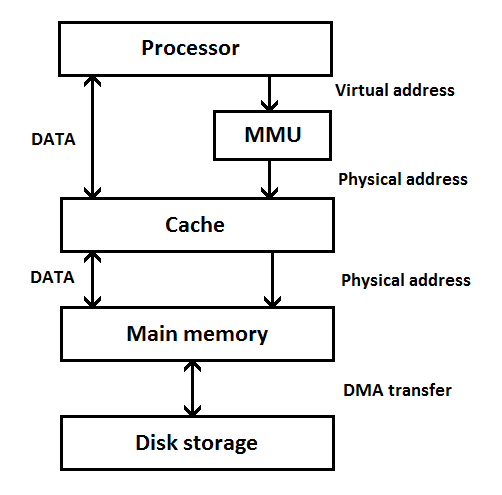
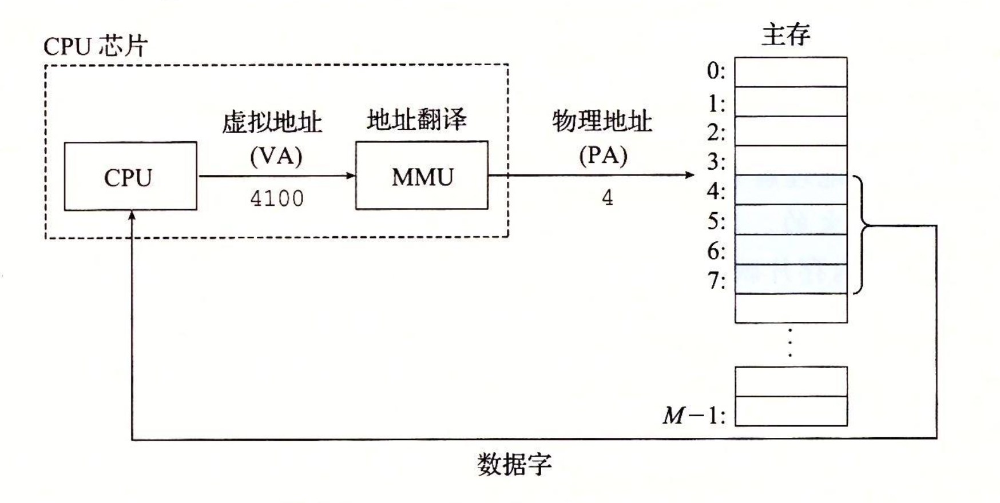
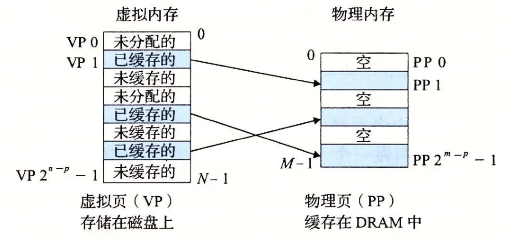
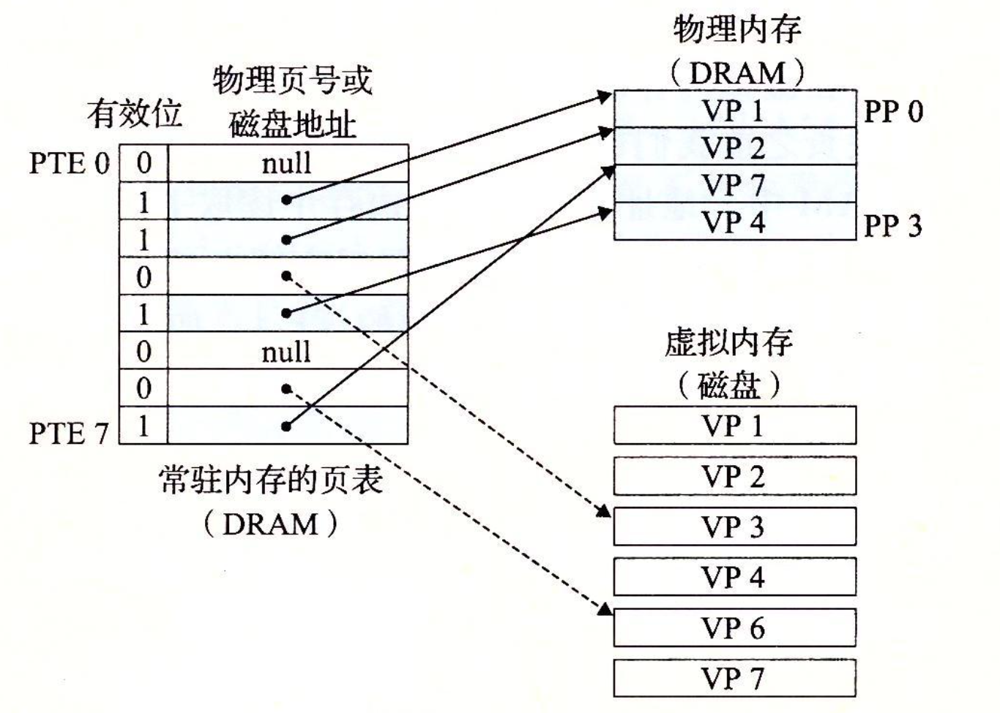
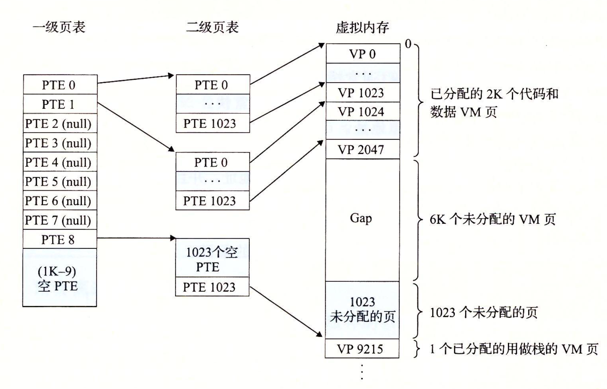
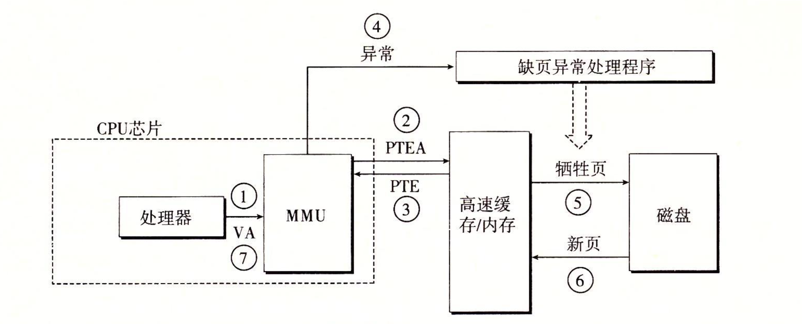

## 虚拟内存

### 作用

为每个进程提供一个大的，一致的和私有的地址空间

#### 作为缓存的工具

高效使用主存，主存按需保存活动区域

虚拟内存把主存看成是一个存储在磁盘上的地址空间的高速缓存，在主存中只保存活动区域，并根据需要，在磁盘和主存之间来回传送数据，从而高效地使用主存

#### 作为内存管理的工具

为每个进程提供一致的地址空间，简化内存管理

- 简化链接

  - 独立的地址空间允许每个进程的内存映射使用相同的基本格式，而不管代码和数据实际放在物理内存的何处。  

  - linux 系统进程地址空间里，数据段是跟在代码段之后，而栈则占据用户地址空间最高的部分，并向下增加，等等。这样的一致性，从而简化了链接器的设计和实现。

- 简化加载

  - 要将目标文件中的 .text 节和 .data 节加载到一个新创建的进程，linux 加载器为代码和数据段分配虚拟页，并记为无效的（即未被缓存的）。 加载器不用从磁盘复制数据到内存。而是在每个页初次被引用时，虚拟内存系统会按照需要自动调入数据页。

- 简化共享

  - 操作系统通过将不同进程中适当的虚拟页映射到相同的物理页，从而安排多个进程共享这部分代码的一个副本。

- 简化内存分配

  - 当用户进程要求额外的堆空间是（如调用 malloc 的结果），操作系统分配一个适当数字（例如 k）个连续的虚拟内存页，并将它们映射到物理内存中任意位置的 k 个任意的物理页，即页面可以随机分散在物理内存中。

#### 作为内存保护的工具

保护每个进程的地址空间不背其他进程破坏

通过在 PTE 上添加一些额外的许可位来控制对一个虚拟页内容的访问。

### 虚拟寻址

CPU 通过虚拟地址访问主存，在访问主存之前，会地址翻译成物理地址进行寻址。

#### 虚拟地址（Virtual Address VA）

##### 组成

- 虚拟页号（ Virtual Page Number VPN ）

- 虚拟页面偏移 ( Virtual Page Offset VPO )

#### 物理地址（Physical Address PA）

##### 组成

- 物理页号 （Physical Page Number PPN）

- 物理页面偏移（Physical Page Offset PPO）

####  虚拟页 （Virtual Page VP）

可分为

- 未分配的
  VM系统未分配（或未创建的）的页，未分配的块没有任何数据和它们相关联，不占用磁盘空间。

- 缓存的
  当前已缓存在物理内存的中的已分配页

- 未缓存的
  未缓存在物理内存中的已分配页
  

##### 内存映射
将一组连续的虚拟页映射到任意一个文件中的任何位置的表示法，叫内存映射。

- mmap
  linux 提供 mmap 的系统调用，允许应用程序自己做内存映射。实现文件物理地址和进程虚拟地址的一一映射关系。	  

  [https://www.cnblogs.com/huxiao-tee/p/4660352.html](https://www.cnblogs.com/huxiao-tee/p/4660352.html)

  - 优点

    - 提高文件读取效率
      对文件的读取操作跨过了页缓存，减少了数据的拷贝次数，用内存读写取代I/O读写，提高了文件读取效率。

    - 实现了用户空间和内核空间的高效交互方式
      两空间的各自修改操作可以直接反映在映射的区域内，从而被对方空间及时捕捉。

    - 提供进程间共享内存及相互通信的方式
      不管是父子进程还是无亲缘关系的进程，都可以将自身用户空间映射到同一个文件或匿名映射到同一片区域。从而通过各自对映射区域的改动，达到进程间通信和进程间共享的目的。

    - 可用于实现高效的大规模数据传输
      内存空间不足，是制约大数据操作的一个方面，解决方案往往是借助硬盘空间协助操作，补充内存的不足。但是进一步会造成大量的文件I/O操作，极大影响效率。这个问题可以通过mmap映射很好的解决。换句话说，但凡是需要用磁盘空间代替内存的时候，mmap都可以发挥其功效。

#### 页表（ Page Table ）

页表是将虚拟页映射到物理页的，存放在物理内存的数据结构

##### 页表条目（Page Table Entry PTE）

- 组成

  - 有效位（valid bit）
    表明了该虚拟页当前是否被缓存。

  - 物理页号
    如果设置了有效位，表示如果没有设置有效位，空地址表示这个虚拟页还未被分配。
  
- 页表条目地址（ Page Table Entry Address PTEA ）

#### 多级页表

##### 作用

减少了对内存的需求

- 如果一级页表的一个 PTE 是空的，相应的二级页表也就不存在  

- 只有一级页表才需要总是在主存中，虚拟内存系统可以在需要时再创建二级页表

#### 页命中

在翻译过程中，虚拟页如果是已缓存的情况，就可以通过 PTE 直接构造出物理内存地址

#### 缺页（page fault）
虚拟页没有被缓存在物理内存中（缓存未命中）被称为缺页。

#### 地址翻译

##### 内存管理单元（Memory Management Unit, MMU）
CPU中含有的硬件。借助存放在内存中的页表动态翻译虚拟地址，将虚拟内存地址转换为物理内存地址。

##### 页面命中流程

- 1. 处理器生成虚拟地址，并传给 MMU

- 2. MMU 生成 PTEA，从高速缓存/主存请求获取 PTE

- 3. 高速缓存/主存向 MMU 返回 PTE

- 4. MMU 构造物理地址，并传给高速缓存/主存

- 5. 高速缓存/主存返回请求的数据给处理器

##### 缺页处理流程

- 1 ~ 3 步骤同上

- 4. 若PTE 有效位为零，则 MMU 触发缺页异常
     异常触发中断，将 CPU 控制权 转交给操作系统内核中的异常处理程序

- 5. 异常处理程序确定出物理内存的牺牲页
     如果牺牲页已经被修改了，则将它换出到磁盘

- 6. 异常处理程序调入新页面，并更新内存中的 PTE
     调入的新页面，是从原 PTE 里获取到的磁盘物理地址，读取数据存入主存

- 7. 异常处理程序返回原来的进程，再次执行导致缺页的指令

- 8. CPU 再次发送引起缺页的虚拟地址给 MMU, 即回到步骤 1

##### 利用 TLB 加速地址翻译

- 翻译后备缓冲区（ Translation Lookaside Butter TLB）
  用来缓存页表条目PTE的硬件设备，相当于页表的缓存
- TLB 标记（ TLBT ）
    如果 TLB 有 2^t 个组，VPN 有  n 位，则 TLBI 是由 VPN 的 n-t 个最高位组成
    
- TLB 索引（ TLBI ）
    如果 TLB 有 2^t 个组，则 TLBI 是由 VPN 的 t 个最低位组成
  
- 作用
  
  - 减少页表查询导致的 CPU 性能下降